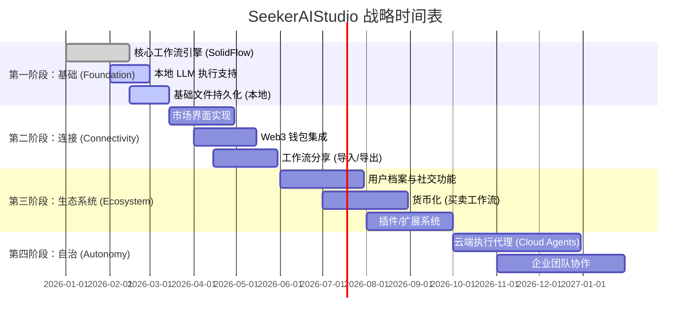

# SeekerAIStudio 产品路线图

本文档概述了 SeekerAIStudio 的战略发展规划，从 MVP 基础到成熟的去中心化 AI 生态系统。

## 可视化路线图

## 详细里程碑

### 🚀 第一阶段：基础建设 (2026年第一季度)
**目标：** 提供一个稳定、离线优先的桌面应用程序，用于创建和运行 AI 工作流。
- [x] **项目设置**: Tauri + SolidJS + TypeScript 环境。
- [x] **UI/UX 设计**: 实现“高级深色”美学。
- [ ] **SolidFlow 引擎**: 
    - 完成标准节点库（输入、输出、LLM、脚本）。
    - 错误处理和调试可视化。
- [ ] **本地执行**:
    - 集成名为 Ollama 的本地模型支持，以及 OpenAI/Anthropic 的 API 密钥支持。
    - UI 中的流式响应。

### 🌐 第二阶段：市场与连接 (2026年第二季度)
**目标：** 允许用户分享其创作并连接去中心化网络。
- [ ] **市场界面**: 浏览详细的工作流卡片。
- [ ] **资产打包**: 定义包含元数据和逻辑的标准 `.seek` 文件格式。
- [ ] **Web3 认证**: 通过 Ethereum/Solana 钱包登录以建立身份。
- [ ] **IPFS 存储**: 将工作流资产存储在去中心化存储上（可选/Beta）。

### 🤝 第三阶段：社交生态系统 (2026年第三季度)
**目标：** 建立一个繁荣的创作者和消费者社区。
- [ ] **交易与买卖**: 用于购买高级工作流的智能合约。
- [ ] **创作者档案**: 展示作品集、声誉评分和交易历史。
- [ ] **社交互动**: 评论、点赞和公共工作流的 Fork。
- [ ] **版本控制**: 跟踪已发布工作流的更改和更新。

### 🧠 第四阶段：高级自治 (2026年第四季度及以后)
**目标：** 将执行能力扩展到桌面之外。
- [ ] **云端代理**: 能够将工作流部署为永远在线的无服务器代理 (Serverless Agents)。
- [ ] **自主触发**: 对外部事件（电子邮件、Webhook 等）做出反应的工作流。
- [ ] **企业功能**: RBAC、团队工作区和共享密钥管理。
