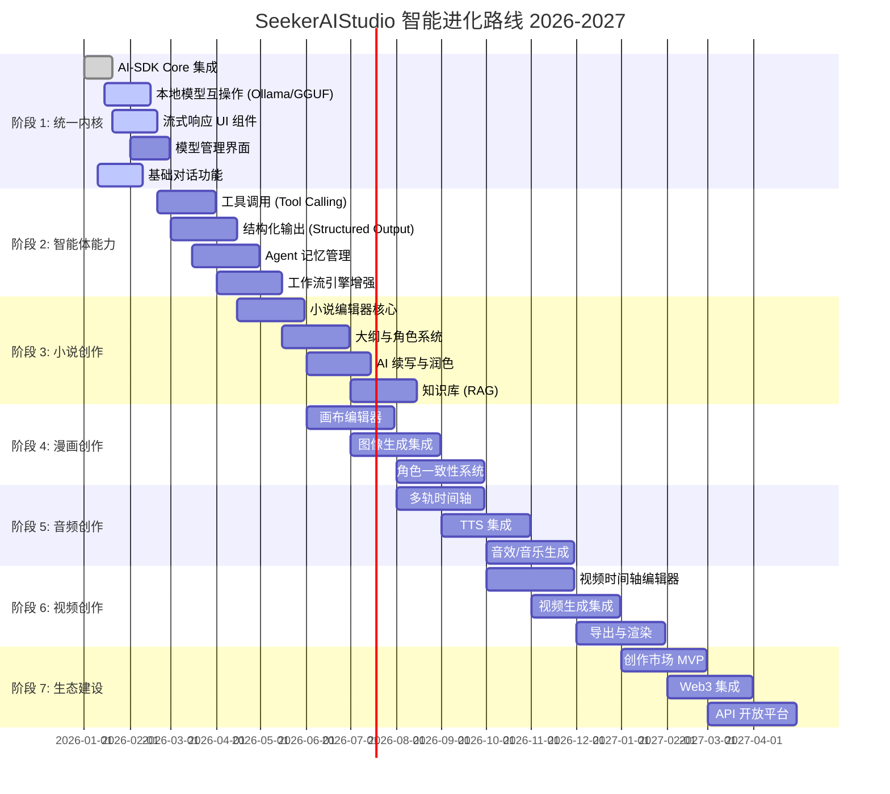
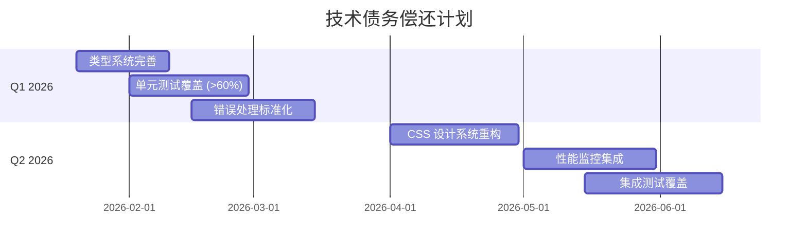

# SeekerAIStudio 产品路线图

> 版本: 2.0
> 最后更新: 2026-01-16
> 规划周期: 2026 Q1 - 2027 Q2

---

## 目录
1. [路线图概览](#1-路线图概览)
2. [里程碑详解](#2-里程碑详解)
3. [功能优先级矩阵](#3-功能优先级矩阵)
4. [技术债务规划](#4-技术债务规划)
5. [发布计划](#5-发布计划)
6. [资源规划](#6-资源规划)
7. [风险缓解](#7-风险缓解)

---

## 1. 路线图概览

### 1.1 战略阶段可视化



### 1.2 阶段目标总览

| 阶段 | 时间 | 核心目标 | 关键产出 |
|------|------|---------|---------|
| 1: 统一内核 | Q1 2026 | 建立稳健的 AI 基础设施 | 基础对话、模型管理 |
| 2: 智能体能力 | Q1-Q2 2026 | 赋予 AI "手"和"眼" | 工具调用、结构化输出 |
| 3: 小说创作 | Q2-Q3 2026 | 发布首个垂直应用 | 小说助手 v1.0 |
| 4: 漫画创作 | Q2-Q3 2026 | 视觉创作能力 | 漫画助手 v1.0 |
| 5: 音频创作 | Q3-Q4 2026 | 听觉创作能力 | 音频助手 v1.0 |
| 6: 视频创作 | Q4 2026-Q1 2027 | 视频编辑能力 | 视频助手 v1.0 |
| 7: 生态建设 | Q1-Q2 2027 | 构建创作者生态 | 市场平台 v1.0 |

---

## 2. 里程碑详解

### 2.1 🚀 第一阶段：统一智能内核 (2026 Q1)

**核心目标:** 建立基于 `ai-sdk` 的稳健底层，打通 Local 和 Cloud 模型。

#### 里程碑 1.1: AI SDK 核心集成 ✅
- **状态**: 已完成
- **完成日期**: 2026-01-20
- **交付物**:
  - [x] 引入 `@ai-sdk/core` 和 `@ai-sdk/openai` 包
  - [x] 基础文本生成功能
  - [x] 流式响应支持

#### 里程碑 1.2: 本地模型互操作
- **状态**: 🔄 进行中
- **预计完成**: 2026-02-15
- **交付物**:
  - [x] Ollama 集成 (通过 OpenAI Compatible Provider)
  - [ ] GGUF 原生推理 (Rust 后端)
  - [ ] 模型下载与管理
  - [ ] 多 GPU 支持检测

**详细任务分解:**
| 任务 | 负责人 | 状态 | 预计工时 |
|------|--------|------|---------|
| Ollama Provider 封装 | - | ✅ 完成 | 8h |
| GGUF 加载器 (Rust) | - | 🔄 进行中 | 24h |
| 模型元数据解析 | - | 📅 待开始 | 8h |
| 推理采样策略 | - | 📅 待开始 | 16h |
| 量化模型支持 | - | 📅 待开始 | 16h |

#### 里程碑 1.3: 流式响应 UI 组件
- **状态**: 🔄 进行中
- **预计完成**: 2026-02-20
- **交付物**:
  - [x] 基础 Chat 组件
  - [ ] 打字机效果动画
  - [ ] 代码块高亮
  - [ ] Markdown 渲染优化
  - [ ] Token 计数显示

#### 里程碑 1.4: 模型管理界面
- **状态**: 📅 待开始
- **预计完成**: 2026-02-28
- **交付物**:
  - [ ] 已安装模型列表
  - [ ] 模型下载进度
  - [ ] 模型参数配置 (温度、Top-P 等)
  - [ ] 默认模型设置
  - [ ] 本地模型文件导入

#### 里程碑 1.5: 基础对话功能
- **状态**: 🔄 进行中
- **预计完成**: 2026-02-10
- **交付物**:
  - [x] 会话创建/删除
  - [x] 消息发送/接收
  - [ ] 会话历史持久化
  - [ ] 多模型切换
  - [ ] 系统提示词设置

### 2.2 🤖 第二阶段：智能体与工具 (2026 Q1-Q2)

**核心目标:** 赋予 AI "手" 和 "眼"，从单纯的对话者变为执行者。

#### 里程碑 2.1: 工具调用 (Tool Calling)
- **状态**: 📅 待开始
- **预计完成**: 2026-03-31
- **交付物**:
  - [ ] Tool 定义框架
  - [ ] 内置工具库:
    - [ ] 文件读写工具
    - [ ] 网络请求工具
    - [ ] 图像生成工具
    - [ ] 代码执行沙箱
  - [ ] 工具注册与发现机制
  - [ ] 工具调用可视化 (Workflow 节点)

**技术方案:**
```typescript
// 工具定义示例
const tools = {
  readFile: tool({
    description: '读取本地文件',
    parameters: z.object({
      path: z.string().describe('文件路径'),
    }),
    execute: async ({ path }) => {
      return await invoke('read_file', { path });
    },
  }),
  
  generateImage: tool({
    description: '生成图像',
    parameters: z.object({
      prompt: z.string().describe('图像描述'),
      width: z.number().default(512),
      height: z.number().default(512),
    }),
    execute: async ({ prompt, width, height }) => {
      return await generateWithSD({ prompt, width, height });
    },
  }),
};
```

#### 里程碑 2.2: 结构化输出 (Structured Output)
- **状态**: 📅 待开始
- **预计完成**: 2026-04-15
- **交付物**:
  - [ ] JSON Schema 验证节点
  - [ ] `generateObject` / `streamObject` 封装
  - [ ] 输出格式可视化编辑器
  - [ ] 错误重试机制

#### 里程碑 2.3: Agent 记忆管理
- **状态**: 📅 待开始
- **预计完成**: 2026-04-30
- **交付物**:
  - [ ] 短期记忆 (Context Window 管理)
  - [ ] 长期记忆 (RAG 基础设施)
  - [ ] 向量数据库集成 (本地 SQLite + 向量扩展)
  - [ ] 记忆检索策略

#### 里程碑 2.4: 工作流引擎增强
- **状态**: 📅 待开始
- **预计完成**: 2026-05-15
- **交付物**:
  - [ ] 条件分支节点
  - [ ] 循环控制节点
  - [ ] 并行执行节点
  - [ ] 子工作流调用
  - [ ] 调试模式 (断点、变量监控)

### 2.3 📚 第三阶段：小说创作助手 (2026 Q2-Q3)

**核心目标:** 发布首个垂直应用，验证产品市场契合度。

#### 里程碑 3.1: 小说编辑器核心
- **状态**: 📅 待开始
- **预计完成**: 2026-05-31
- **交付物**:
  - [ ] 基于 TipTap/Prosemirror 的富文本编辑器
  - [ ] Markdown 支持
  - [ ] 章节导航侧边栏
  - [ ] 自动保存
  - [ ] 字数统计

#### 里程碑 3.2: 大纲与角色系统
- **状态**: 📅 待开始
- **预计完成**: 2026-06-30
- **交付物**:
  - [ ] 三级大纲编辑器 (卷-章-节)
  - [ ] 角色卡创建与管理
  - [ ] 角色关系图谱
  - [ ] 世界观设定库
  - [ ] 大纲/角色 AI 生成

#### 里程碑 3.3: AI 续写与润色
- **状态**: 📅 待开始
- **预计完成**: 2026-07-15
- **交付物**:
  - [ ] 光标处续写 (Ghost Text)
  - [ ] 选中文本润色
  - [ ] 多风格续写选项
  - [ ] Slash 命令系统
  - [ ] 上下文智能注入

#### 里程碑 3.4: 知识库 (RAG)
- **状态**: 📅 待开始
- **预计完成**: 2026-08-15
- **交付物**:
  - [ ] 文档向量化
  - [ ] 相似度检索
  - [ ] 写作时自动引用相关设定
  - [ ] 前文摘要生成

### 2.4 🎨 第四阶段：漫画创作助手 (2026 Q2-Q3)

**核心目标:** 实现文字到视觉的转化，打通小说→漫画流程。

#### 里程碑 4.1: 画布编辑器
- **状态**: 📅 待开始
- **预计完成**: 2026-07-31
- **交付物**:
  - [ ] 无限画布 (Pan & Zoom)
  - [ ] 分镜格子编辑
  - [ ] 模板库 (四格、页漫、条漫)
  - [ ] 气泡文字编辑
  - [ ] 图层系统

#### 里程碑 4.2: 图像生成集成
- **状态**: 📅 待开始
- **预计完成**: 2026-08-31
- **交付物**:
  - [ ] Stable Diffusion API 对接
  - [ ] DALL-E 3 集成
  - [ ] ComfyUI 工作流调用
  - [ ] 局部重绘 (Inpainting)
  - [ ] 提示词优化器

#### 里程碑 4.3: 角色一致性系统
- **状态**: 📅 待开始
- **预计完成**: 2026-09-30
- **交付物**:
  - [ ] 角色特征库
  - [ ] LoRA 模型管理
  - [ ] 参考图固定 (IP-Adapter)
  - [ ] Seed 锁定
  - [ ] 多姿态生成

### 2.5 🎵 第五阶段：音频创作助手 (2026 Q3-Q4)

**核心目标:** 实现专业级有声书和音效制作能力。

#### 里程碑 5.1: 多轨时间轴
- **状态**: 📅 待开始
- **预计完成**: 2026-09-30
- **交付物**:
  - [ ] 多轨时间轴组件
  - [ ] 波形显示
  - [ ] 拖拽编辑
  - [ ] 播放控制
  - [ ] 音量推子 & Mute/Solo

#### 里程碑 5.2: TTS 集成
- **状态**: 📅 待开始
- **预计完成**: 2026-10-31
- **交付物**:
  - [ ] Edge TTS (免费)
  - [ ] ChatTTS/VITS (本地)
  - [ ] ElevenLabs (云端)
  - [ ] 多角色自动分配
  - [ ] 情感控制

#### 里程碑 5.3: 音效/音乐生成
- **状态**: 📅 待开始
- **预计完成**: 2026-11-30
- **交付物**:
  - [ ] Text-to-SFX (AudioLDM)
  - [ ] Text-to-Music (MusicGen/Suno)
  - [ ] 环境音生成
  - [ ] 自动 Ducking
  - [ ] 导出 (MP3/WAV/FLAC)

### 2.6 🎬 第六阶段：视频创作助手 (2026 Q4 - 2027 Q1)

**核心目标:** 实现从剧本到视频的一站式制作。

#### 里程碑 6.1: 视频时间轴编辑器
- **状态**: 📅 待开始
- **预计完成**: 2026-11-30
- **交付物**:
  - [ ] 视频/音频/字幕轨道
  - [ ] 缩略图预览
  - [ ] 剪切/拼接/裁剪
  - [ ] 转场效果库
  - [ ] 实时预览播放器

#### 里程碑 6.2: 视频生成集成
- **状态**: 📅 待开始
- **预计完成**: 2026-12-31
- **交付物**:
  - [ ] Text-to-Video (Runway/Kling API)
  - [ ] Image-to-Video (SVD/AnimateDiff)
  - [ ] 运动控制参数
  - [ ] 关键帧生成
  - [ ] 镜头语言解析

#### 里程碑 6.3: 导出与渲染
- **状态**: 📅 待开始
- **预计完成**: 2027-01-31
- **交付物**:
  - [ ] 本地渲染 (ffmpeg.wasm)
  - [ ] 云端渲染服务
  - [ ] 超分辨率
  - [ ] 插帧
  - [ ] 多格式导出 (MP4/WebM/GIF)

### 2.7 🌐 第七阶段：生态建设 (2027 Q1-Q2)

**核心目标:** 构建创作者社区和交易生态。

#### 里程碑 7.1: 创作市场 MVP
- **预计完成**: 2027-02-28
- **交付物**:
  - [ ] Agent 模板上传
  - [ ] 工作流分享
  - [ ] 素材包 (LoRA/Voice)
  - [ ] 用户评价系统
  - [ ] 下载/使用统计

#### 里程碑 7.2: Web3 集成
- **预计完成**: 2027-03-31
- **交付物**:
  - [ ] 钱包连接
  - [ ] 创作时间戳上链
  - [ ] NFT 铸造
  - [ ] 智能合约支付

#### 里程碑 7.3: API 开放平台
- **预计完成**: 2027-04-30
- **交付物**:
  - [ ] API 密钥管理
  - [ ] 速率限制
  - [ ] 使用量统计
  - [ ] 开发者文档
  - [ ] SDK (Python/JS)

---

## 3. 功能优先级矩阵

### 3.1 MoSCoW 分析

#### Must Have (必须有)
| 功能 | 模块 | 阶段 |
|------|------|------|
| 基础对话 | Core | 1 |
| 流式响应 | Core | 1 |
| 本地模型支持 | Core | 1 |
| 模型管理 | Core | 1 |
| 小说编辑器 | Novel | 3 |
| AI 续写 | Novel | 3 |

#### Should Have (应该有)
| 功能 | 模块 | 阶段 |
|------|------|------|
| 工具调用 | Core | 2 |
| 大纲系统 | Novel | 3 |
| 角色管理 | Novel | 3 |
| 画布编辑 | Comic | 4 |
| 图像生成 | Comic | 4 |
| TTS | Audio | 5 |

#### Could Have (可以有)
| 功能 | 模块 | 阶段 |
|------|------|------|
| RAG 知识库 | Novel | 3 |
| 角色一致性 | Comic | 4 |
| 音乐生成 | Audio | 5 |
| 视频生成 | Video | 6 |
| 创作市场 | Ecosystem | 7 |

#### Won't Have (暂不考虑)
| 功能 | 原因 |
|------|------|
| 实时协作编辑 | 技术复杂度高，第一年暂不实现 |
| 移动端应用 | 优先保证桌面端体验 |
| 自托管服务端 | 专注本地优先策略 |

### 3.2 价值/复杂度矩阵

```
                    高价值
                       │
       ┌───────────────┼───────────────┐
       │ Quick Wins    │ Strategic     │
       │ (优先做)       │ (计划做)       │
       │               │               │
       │ • 流式对话     │ • 工具调用     │
       │ • 小说编辑器   │ • RAG 知识库   │
       │ • AI 续写     │ • 视频生成     │
       │               │               │
低复杂度├───────────────┼───────────────┤高复杂度
       │               │               │
       │ Fill-Ins     │ Avoid         │
       │ (按需做)      │ (谨慎做)       │
       │               │               │
       │ • 主题切换     │ • 实时协作     │
       │ • 导出格式     │ • 区块链深度   │
       │               │               │
       └───────────────┼───────────────┘
                       │
                    低价值
```

---

## 4. 技术债务规划

### 4.1 当前技术债务

| 债务描述 | 影响 | 优先级 | 计划解决时间 |
|---------|------|--------|-------------|
| 部分组件未类型化 | 类型安全 | Medium | 2026-Q1 |
| 缺少单元测试 | 代码质量 | High | 2026-Q1 |
| CSS 样式缺乏系统化 | 可维护性 | Medium | 2026-Q2 |
| 错误处理不统一 | 用户体验 | High | 2026-Q1 |
| 缺少性能监控 | 可观测性 | Medium | 2026-Q2 |

### 4.2 技术债务偿还计划



---

## 5. 发布计划

### 5.1 版本规划

| 版本 | 代号 | 预计日期 | 主要功能 |
|------|------|---------|---------|
| v0.1.0 | Alpha | 2026-02-28 | 基础对话、模型管理 |
| v0.2.0 | Beta | 2026-04-30 | 工具调用、工作流 |
| v0.3.0 | Novel Preview | 2026-06-30 | 小说编辑器 |
| v0.4.0 | Novel GA | 2026-08-15 | 小说助手完整版 |
| v0.5.0 | Comic Preview | 2026-09-30 | 漫画编辑器 |
| v0.6.0 | Audio Preview | 2026-11-30 | 音频编辑器 |
| v0.7.0 | Video Preview | 2027-01-31 | 视频编辑器 |
| v1.0.0 | GA | 2027-03-31 | 正式版发布 |

### 5.2 发布检查清单

#### Alpha 发布前 (v0.1.0)
- [ ] 核心功能可用
- [ ] 无阻塞性 Bug
- [ ] 基本文档完善
- [ ] 内部测试通过

#### Beta 发布前 (v0.2.0)
- [ ] 主要功能完整
- [ ] 性能达标
- [ ] UI 基本完善
- [ ] 公开测试反馈收集机制

#### GA 发布前 (v1.0.0)
- [ ] 所有 P0/P1 功能完成
- [ ] 自动化测试覆盖率 > 70%
- [ ] 性能基准达标
- [ ] 安全审计通过
- [ ] 完整用户文档
- [ ] 法律合规审查

---

## 6. 资源规划

### 6.1 团队配置建议

| 角色 | 人数 | 职责 |
|------|------|------|
| 产品经理 | 1 | 产品规划、需求管理 |
| 前端工程师 | 2 | SolidJS UI 开发 |
| Rust 工程师 | 1 | Tauri 后端、AI 推理 |
| AI 工程师 | 1 | 模型集成、Prompt 工程 |
| UI/UX 设计师 | 1 | 界面设计、交互设计 |
| QA 工程师 | 1 | 测试、质量保证 |

### 6.2 基础设施成本预估 (月度)

| 项目 | 成本 |
|------|------|
| 云端 AI API (开发/测试) | ¥5,000 |
| 云服务器 (渲染/存储) | ¥3,000 |
| 域名/CDN | ¥500 |
| 第三方服务 | ¥1,000 |
| **总计** | **¥9,500** |

---

## 7. 风险缓解

### 7.1 技术风险

| 风险 | 可能性 | 影响 | 缓解策略 |
|------|--------|------|---------|
| AI 模型 API 变更 | 中 | 高 | 抽象层封装，版本锁定 |
| 本地推理性能不足 | 中 | 中 | 提供云端回退，优化量化 |
| 跨平台兼容问题 | 中 | 中 | 持续多平台测试 |

### 7.2 产品风险

| 风险 | 可能性 | 影响 | 缓解策略 |
|------|--------|------|---------|
| 功能范围蔓延 | 高 | 高 | 严格需求评审，MVP 思维 |
| 用户采纳率低 | 中 | 高 | 早期用户反馈，持续迭代 |
| 竞品抢先发布 | 中 | 中 | 差异化定位，快速迭代 |

### 7.3 市场风险

| 风险 | 可能性 | 影响 | 缓解策略 |
|------|--------|------|---------|
| AI 监管政策变化 | 中 | 高 | 关注政策，提前合规 |
| 版权争议 | 中 | 高 | 法律声明，用户协议 |
| 定价策略失误 | 中 | 中 | A/B 测试，用户调研 |

---

## 附录

### A. 术语表
| 术语 | 定义 |
|------|------|
| MVP | Minimum Viable Product，最小可行产品 |
| GA | General Availability，正式发布 |
| RAG | Retrieval-Augmented Generation，检索增强生成 |
| TTS | Text-to-Speech，文本转语音 |
| P0/P1/P2 | 优先级等级 (P0 最高) |

### B. 相关文档
- [产品设计文档 (PRD)](../product/PRD.md)
- [技术架构文档](../technical/Architecture.md)
- [UI/UX 设计规范](../design/UIUX.md)

### C. 变更记录
| 日期 | 版本 | 变更内容 |
|------|------|---------|
| 2026-01-16 | 2.0 | 完整重写路线图，增加详细里程碑 |
| 2026-01-01 | 1.0 | 初始版本 |
