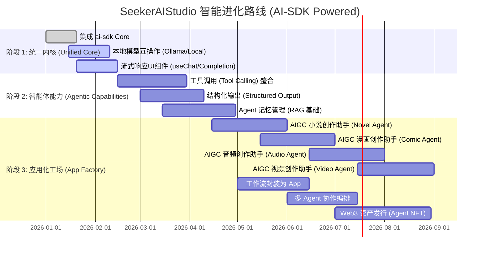

# SeekerAIStudio 产品路线图

本文档规划了以 `ai-sdk` 为核心，构建全能型 Agent 开发与运行平台的演进路径。

## 战略阶段可视化

## 详细里程碑规划

### 🚀 第一阶段：统一智能内核 (Q1 2026)
**核心目标：** 建立基于 `ai-sdk` 的稳健底层，打通 Local 和 Cloud 模型。
- [x] **SDK 集成**: 引入 `@ai-sdk/core` 和 `@ai-sdk/openai` 等包。
- [ ] **多模型配置**: UI 界面支持用户添加自定义的 OpenAI 兼容端点（如 DeepSeek, LocalAI）。
- [ ] **基础对话组件**: 利用 `useChat` 钩子重构现有的对话界面，支持流式渲染。
- [ ] **Prompt 模板**: 在工作流节点中支持动态 Prompt 注入。

### 🤖 第二阶段：智能体与工具 (Q2 2026)
**核心目标：** 赋予 AI "手" 和 "眼"，从单纯的对话者变为执行者。
- [ ] **工具注册表 (Tool Registry)**:
    - 文件读写工具 (File System)
    - 网页搜索/抓取工具 (Web Browser)
    - 代码执行沙箱 (Code Interpreter)
- [ ] **智能路由**: 利用 `generateText` 的 `tools` 参数，让模型自主决定何时调用工具。
- [ ] **结构化节点**: 新增 "JSON提取器" 节点，利用 `streamObject` 强制模型输出符合 Schema 的数据，用于后续流程逻辑判断。

### 🏭 第三阶段：应用运行与生态 (Q3 2026)
**核心目标：** 让工作流“走出”编辑器，成为独立可用的应用。
- [ ] **Runtime App View**: "用户模式"视图，隐藏节点编辑器，只展示 AI 生成的交互界面（Chat UI 或 Form UI）。
- [ ] **AIGC 小说助手 (Vertical App)**:
    - [ ] 核心编辑器与上下文注入
    - [ ] 角色/大纲管理侧边栏
    - [ ] 导出功能 (EPUB/PDF)
- [ ] **AIGC 漫画助手 (Vertical App)**:
    - [ ] 剧本转分镜 (Script to Storyboard)
    - [ ] 角色一致性控制 (Character Consistency / LoRA)
    - [ ] 漫画面板编辑器 (Panel Editor with Image Gen)
- [ ] **AIGC 音频助手 (Vertical App)**:
    - [ ] 多角色语音合成 (Multi-Speaker TTS)
    - [ ] 智能音效生成 (Text-to-SFX)
    - [ ] 背景音乐生成 (Text-to-Music)
- [ ] **AIGC 视频助手 (Vertical App)**:
    - [ ] 剧本转视频 (Script to Video)
    - [ ] 关键帧控制 (Keyframe Control)
    - [ ] 视频剪辑 (AI Video Editor)
- [ ] **Agent 协作**: 允许一个工作流调用另一个工作流（Sub-flow Agent）。
- [ ] **市场集成**: 允许交易配置好的 Agent 包（包含 Prompt, Tools 配置, 模型偏好）。

### 🧠 第四阶段：高级自治 (Q4 2026+)
- [ ] **长期记忆 (Long-term Memory)**: 基于向量数据库的知识库挂载。
- [ ] **自主 Loop**: 允许 Agent 在一定目标下自主循环规划任务（ReAct 模式的可视化实现）。
